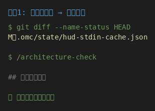
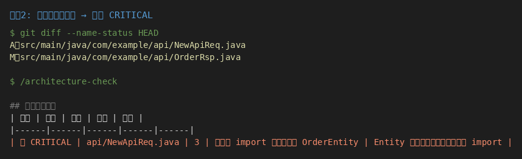
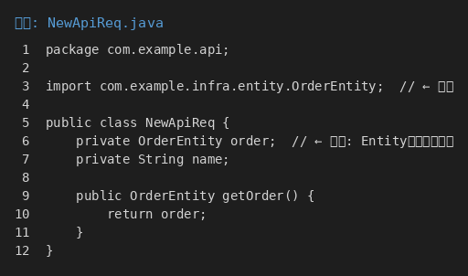
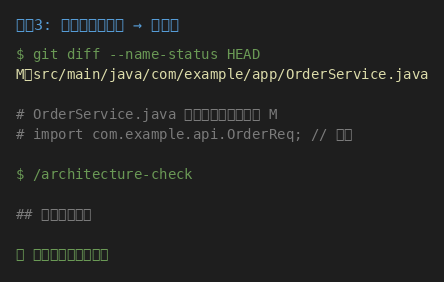
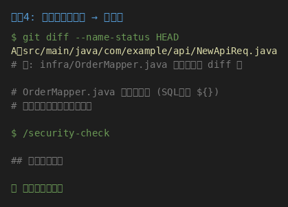
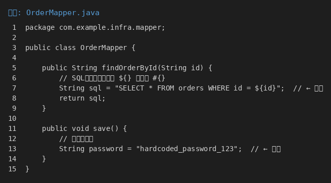
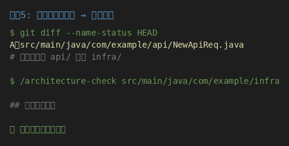
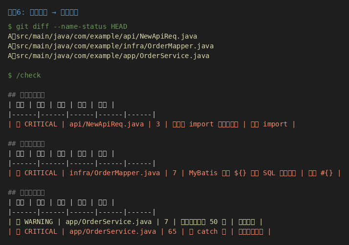
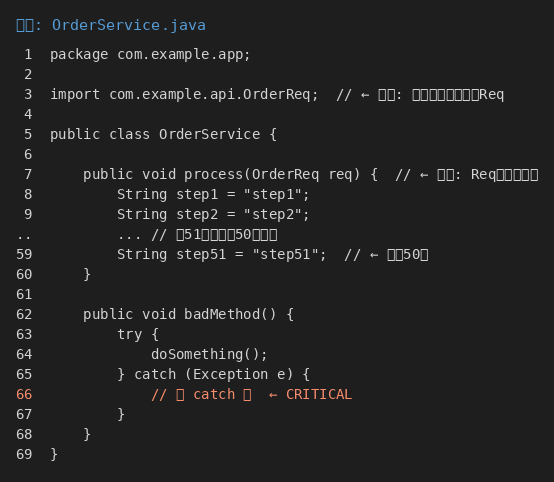

# oh-help-me

一个用于 Java 代码审查工作流的 Claude Code 插件，支持 Clean Architecture 检查。

## 核心逻辑

```
用户调用 /architecture-check
        ↓
检查 git diff --name-status HEAD
        ↓
┌───────────────────────────────────────┐
│  状态为 A (Added)？                    │
│  ├─ 是 → 严格检查架构违规              │
│  └─ 否 (M/D/无变更) → 跳过检查         │
└───────────────────────────────────────┘
        ↓
输出检查结果
```

**为什么这样设计？**

| 状态 | 说明 | 处理方式 |
|------|------|----------|
| A (Added) | 新增文件 | 严格检查，确保新代码符合规范 |
| M (Modified) | 修改已有文件 | 跳过架构检查，尊重存量代码 |
| 不在 diff 中 | 存量文件 | 不检查，避免对历史代码的干扰 |

## 安装

```bash
# 从 GitHub 安装
/plugin install https://github.com/Emtemf/oh-help-me

# 或从本地目录安装
/plugin install /path/to/oh-help-me
```

## 功能

### Skills（技能）

#### `architecture-check` - 架构检查
检查 Clean Architecture 合规性：
- 依赖方向违规（领域层引用基础设施层）
- 对象边界违规（Entity 泄露到基础设施层外）

```bash
# 仅检查 git diff 变更文件（新增文件）
/architecture-check

# 检查指定路径
/architecture-check src/main/java
```

#### `security-check` - 安全检查
检查 Java 安全问题：
- SQL 注入（MyBatis `${}`）
- 硬编码密钥
- 不安全反序列化

```bash
/security-check
```

#### `quality-check` - 质量检查
检查代码质量：
- 方法长度超过 50 行
- 空 catch 块
- printStackTrace 调用

```bash
/quality-check
```

### Command（命令）

#### `check` - 全面检查
并行执行所有检查：

```bash
/check              # 检查 git diff 变更
/check src/main/    # 检查指定路径
```

---

## 架构规范

### 目录结构（按模块划分）

```
com.example
├── order/                    # 订单模块
│   ├── interface/            # 接口层
│   │   ├── controller/       # api-codegen 生成
│   │   ├── req/
│   │   ├── rsp/
│   │   └── convert/          # Req/Rsp ↔ DTO
│   ├── application/          # 应用层
│   │   ├── dto/
│   │   └── convert/          # DTO ↔ Model
│   ├── domain/               # 领域层
│   │   ├── model/
│   │   └── gateway/
│   └── infrastructure/       # 基础设施层
│       ├── entity/
│       └── convert/          # Entity ↔ Model
│
├── payment/                  # 支付模块
└── user/                     # 用户模块
```

### 转换规则

每层都有 `convert/` 目录，转换是垂直的：

| 层 | convert 位置 | 转换内容 |
|---|-------------|---------|
| 接口层 | interface/convert/ | Req/Rsp ↔ DTO |
| 应用层 | application/convert/ | DTO ↔ Model |
| 基础设施层 | infrastructure/convert/ | Entity ↔ Model |

---

## 验证证据

以下是在真实项目中运行的实际输出截图，证明插件按设计工作。

### 场景 1：无新增文件 → 跳过检查



**验证逻辑：** git diff 中只有 M 状态的文件（非 .java），无 `A` 状态的 `.java` 文件，因此跳过检查，输出"未发现问题"。

---

### 场景 2：新增文件包含架构违规 → 报告 CRITICAL



**问题源码：**



**验证逻辑：**
- `NewApiReq.java` 状态为 `A`（新增）→ 触发严格检查
- 发现第 3 行 `import com.example.infra.entity.OrderEntity` → 接口层引用基础设施层
- 发现第 6 行 `private OrderEntity order` → Entity 泄露到接口层
- 报告 🔴 CRITICAL，建议移除 import

---

### 场景 3：修改文件不检查 → 无报告



**验证逻辑：** `OrderService.java` 状态为 `M`（修改），不是新增文件，因此跳过架构检查。这是设计行为，尊重存量代码。即使文件中存在违规（应用层引用接口层 Req），也不会报告。

---

### 场景 4：存量文件不检查 → 无报告



**存量文件（含安全问题）：**



**验证逻辑：** `OrderMapper.java` 不在 git diff 中（存量文件），即使存在 SQL 注入风险（使用 `${}`）和硬编码密钥，也不会检查。

---

### 场景 5：指定路径无新增文件 → 跳过检查



**验证逻辑：** 新增文件 `NewApiReq.java` 在 `api/` 目录，不在 `infra/` 目录。当指定路径 `src/main/java/com/example/infra` 时，该路径下无新增文件，因此跳过检查。

---

### 场景 6：全面检查 → 并行报告



**问题源码：**



**验证逻辑：**
- 三个新增文件触发三种检查
- `NewApiReq.java` → 架构违规（接口层引用基础设施层）
- `OrderMapper.java` → 安全违规（SQL 注入 `${}`）
- `OrderService.java` → 质量问题（方法超过 50 行 + 空 catch 块）

---

## 验证覆盖总结

| 场景 | git diff 状态 | 预期行为 | 实际结果 |
|------|--------------|----------|----------|
| 无新增文件 | M (非 .java) | 跳过检查 | ✅ 见场景1截图 |
| 新增文件有违规 | A | 报告 CRITICAL | ✅ 见场景2截图 |
| 修改文件有违规 | M | 不报告 | ✅ 见场景3截图 |
| 存量文件有违规 | 不在 diff | 不报告 | ✅ 见场景4截图 |
| 指定路径无新增 | A (在其他路径) | 跳过检查 | ✅ 见场景5截图 |
| 全面检查多违规 | A (多个文件) | 并行报告 | ✅ 见场景6截图 |

---

## 输出格式

```
## 检查结果
| 严重 | 文件 | 行号 | 问题 | 建议 |
|------|------|------|------|------|
| 🔴 CRITICAL | domain/Order.java | 3 | 领域层 import 基础设施层 | 移除 import |
| 🟡 WARNING | app/OrderService.java | 52 | 方法长度超过 50 行 | 拆分方法 |
```

严重级别说明：
- 🔴 CRITICAL - 提交前必须修复
- 🟡 WARNING - 应该修复
- 🔵 SUGGESTION - 建议优化

## 配置

插件遵循项目级 `.claude/rules/clean-architecture/` 规则：

- `boundary.md` - 层边界规则
- `legacy-code.md` - 增量检查策略
- `layer-*.md` - 各层特定规则

## 许可证

MIT