# 简洁架构分层指南

适配 `api-codegen` 工具链 + MapStruct，适用于中规模项目。

## 分层架构图

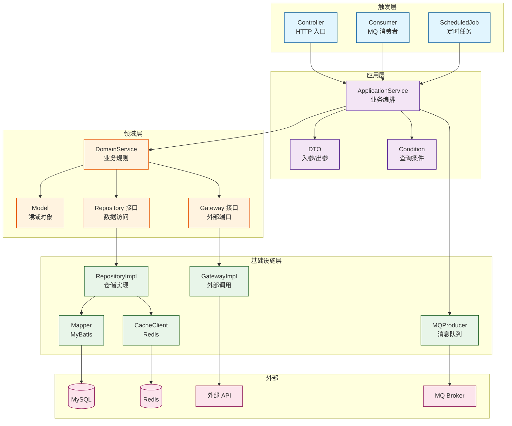

---

## 对象命名规范

### 各层对象一览表

| 层 | 对象类型 | 命名示例 | 说明 |
|---|---|---|---|
| 接口层 | 请求 | `CreateOrderReq` | api-codegen 生成 |
| 接口层 | 响应 | `OrderRsp` | api-codegen 生成 |
| 应用层 | 写入参 | `CreateOrderDTO` | 复杂场景用，简单场景直接拆字段 |
| 应用层 | 查入参 | `OrderListCondition` | 条件查询 |
| 应用层 | 出参 | `OrderDTO`, `OrderDetailDTO` | 统一叫 DTO |
| 应用层 | 分页 | `PageDTO<T>` | 分页包装 |
| 领域层 | 实体 | `Order`, `User` | 不带 Entity 后缀 |
| 领域层 | 服务 | `OrderService` | 领域服务 |
| 领域层 | 仓储接口 | `OrderRepository` | 数据访问接口 |
| 领域层 | 外部端口 | `PaymentGateway` | 外部调用接口，见下方详细说明 |
| 基础设施层 | 实体 | `OrderEntity`, `UserEntity` | 数据库表映射，带 Entity 后缀 |
| 基础设施层 | 仓储实现 | `OrderRepositoryImpl` | 实现领域层接口 |
| 基础设施层 | Mapper | `OrderMapper` | MyBatis |
| 基础设施层 | 外部请求/响应 | `WechatPayRequest` | 只在基础设施层内 |

### 入参规则

```java
// 简单场景（≤3 字段）：直接拆开传
public OrderDTO getOrder(Long orderId)
public void cancelOrder(Long orderId)
public void updateOrder(Long id, String address, String remark)

// 复杂场景：用 DTO 包装
public Long createOrder(CreateOrderDTO dto)
public PageDTO<OrderListDTO> listOrders(OrderListCondition condition)
```

---

## 对象转换方案（MapStruct）

### 转换方向与方式

核心原则：**领域对象（Model）是稳定的，DTO 会跟着接口变化，所以 Model → DTO 用 MapStruct 自动生成，其余手写即可。**

| 转换方向 | 方式 | 位置 | 说明 |
|---|---|---|---|
| Req → 字段/DTO | 手写 | 接口层 Controller | Req 是生成的，拆字段即可 |
| Condition 构造 | 手写 | 接口层 Controller | 简单构造 |
| Model → DTO | MapStruct | 应用层 convert/ | Model 稳定字段多，DTO 跟着接口变，MapStruct 编译期生成省手写 |
| DTO → Rsp | 手写 | 接口层私有方法 | Rsp 是生成的，字段少直接赋值 |
| 外部响应 → 领域对象 | 手写/MapStruct | 基础设施层 | 外部对象不出基础设施层 |

### 为什么转换器不收敛到基础设施层？

转换器放在应用层而非基础设施层，原因：

- **依赖方向**：分层依赖是 接口层 → 应用层 → 领域层 → 基础设施层。`Model → DTO` 转换器依赖 DTO（应用层对象），放基础设施层会反向依赖
- **职责清晰**：基础设施层只负责 `外部响应 → 领域对象`，混入 `Model → DTO` 会让职责不清
- **测试便利**：应用层转换器可纯单元测试，放基础设施层则需要 mock 数据库

### MapStruct 使用示例

```java
// ===== MapStruct Mapper（放在 application/convert/） =====
@Mapper
public interface OrderDTOMapper {
    OrderDTOMapper INSTANCE = Mappers.getMapper(OrderDTOMapper.class);

    OrderDTO toDTO(Order order);
    List<OrderDTO> toDTOList(List<Order> orders);
    OrderDetailDTO toDetailDTO(Order order);
}

// ===== DTO 类里静态工厂方法 =====
public class OrderDTO {
    private Long id;
    private String status;
    private BigDecimal totalAmount;

    public static OrderDTO from(Order order) {
        return OrderDTOMapper.INSTANCE.toDTO(order);
    }

    public static List<OrderDTO> fromList(List<Order> orders) {
        return OrderDTOMapper.INSTANCE.toDTOList(orders);
    }
}
```

**说明：**
- `INSTANCE` 放在 Mapper 接口里是 MapStruct 标准用法
- DTO 里的 `from()` 是语法糖，让调用更简洁：`OrderDTO.from(order)` 比 `OrderDTOMapper.INSTANCE.toDTO(order)` 更短
- 如果字段名完全一致，MapStruct 自动映射，无需额外配置

### 外部端口（六边形架构）

采用六边形架构（Ports & Adapters）隔离外部服务调用：
- **端口（Port）**：领域层定义的接口，表达"需要什么能力"
- **适配器（Adapter）**：基础设施层的实现，表达"如何提供能力"

命名约定：
- 端口接口用 `XxxGateway`（如 `PaymentGateway`）
- 适配器实现用 `具体渠道 + Gateway`（如 `WechatPaymentGateway`）

**为什么需要端口/适配器模式：**

| 不用端口模式 | 用端口模式 |
|---|---|
| 领域层直接写 HTTP 请求 | 领域层调接口，基础设施层实现 |
| Request/Response 泄露到领域层 | 外部对象只在基础设施层 |
| 切换渠道要改领域层代码 | 只换适配器实现类 |
| mock HTTP 调用 | mock 接口即可 |

**常见端口与适配器：**

| 端口（领域层接口） | 适配器（基础设施层实现） | 外部服务 |
|------|------|------|
| `PaymentGateway` | `WechatPaymentGateway` / `AlipayPaymentGateway` | 支付 |
| `SmsGateway` | `AliyunSmsGateway` / `TencentSmsGateway` | 短信 |
| `OssGateway` | `AliyunOssGateway` / `MinioOssGateway` | 存储 |
| `EmailGateway` | `SmtpEmailGateway` / `SendgridEmailGateway` | 邮件 |

---

## 对象转换迁移策略（BeanUtils → MapStruct）

### 背景

存量代码使用 BeanUtils，新代码使用 MapStruct。为保证平滑迁移，建立新旧文件夹共存，逐步替换收敛。

### 目录结构（迁移期）

```
com.example.order
├── application/
│   ├── convert/                      # MapStruct Convert（新）
│   │   ├── OrderDTOMapper.java
│   │   └── UserDTOMapper.java
│   ├── dto/
│   │   └── converter/                # BeanUtils Converter（旧，逐步删除）
│   │       ├── OrderConverter.java   # @Deprecated
│   │       └── UserConverter.java    # @Deprecated
```

### 迁移步骤

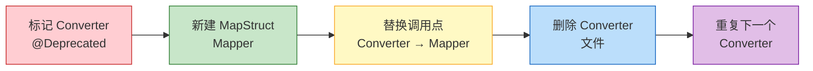

| 步骤 | 操作 | 说明 |
|---|---|---|
| 1 | 标记 `@Deprecated` | 给旧 Converter 加注解，IDE 会警告调用点 |
| 2 | 新建 MapStruct Mapper | 在 `convert/` 下创建对应的 Mapper 接口 |
| 3 | 替换调用点 | 全局搜索 `XxxConverter.to`，替换为 `XxxDTO.from` |
| 4 | 删除 Converter | 确认无调用后，删除 `converter/` 下的文件 |
| 5 | 重复 | 处理下一个 Converter |

### 代码对照

```java
// ===== 旧：BeanUtils Converter（converter/OrderConverter.java） =====
@Deprecated(since = "2024-01", forRemoval = true)
public class OrderConverter {
    public static OrderDTO toDTO(Order order) {
        OrderDTO dto = new OrderDTO();
        BeanUtils.copyProperties(order, dto);
        return dto;
    }
}

// ===== 新：MapStruct Mapper（convert/OrderDTOMapper.java） =====
@Mapper
public interface OrderDTOMapper {
    OrderDTOMapper INSTANCE = Mappers.getMapper(OrderDTOMapper.class);

    OrderDTO toDTO(Order order);
    List<OrderDTO> toDTOList(List<Order> orders);
}

// ===== DTO 静态工厂方法 =====
public class OrderDTO {
    public static OrderDTO from(Order order) {
        return OrderDTOMapper.INSTANCE.toDTO(order);
    }
}
```

### 迁移优先级

| 优先级 | 场景 | 原因 |
|---|---|---|
| 高 | 频繁调用的 Converter | 性能提升明显 |
| 高 | 复杂对象转换 | MapStruct 编译期检查，减少运行时错误 |
| 中 | 简单对象转换 | 收益一般，但统一代码风格 |
| 低 | 即将废弃的模块 | 不值得迁移 |

### 完成标志

```java
// converter/ 目录为空或不存在
// 所有调用点都使用 XxxDTO.from() 或 XxxDTOMapper
```

---

## 目录结构

```
com.example.order
├── api/                              # 接口层（api-codegen 生成）
│   ├── controller/                   # api-codegen 生成的 Controller
│   ├── req/                          # api-codegen 生成
│   ├── rsp/                          # api-codegen 生成
│   ├── consumer/                     # MQ 消费者（手写）
│   │   └── OrderEventConsumer.java
│   └── scheduled/                    # 定时任务（手写）
│       └── OrderScheduledJobs.java
│
├── application/                      # 应用层
│   ├── OrderApplicationService.java
│   ├── dto/
│   │   ├── OrderDTO.java
│   │   ├── OrderDetailDTO.java
│   │   ├── CreateOrderDTO.java
│   │   └── PageDTO.java
│   ├── convert/                      # MapStruct 转换器
│   │   └── OrderDTOMapper.java
│   └── condition/
│       └── OrderListCondition.java
│
├── domain/                           # 领域层
│   ├── service/
│   │   └── OrderService.java
│   ├── model/
│   │   ├── Order.java
│   │   ├── OrderLine.java
│   │   └── OrderStatus.java
│   ├── repository/
│   │   └── OrderRepository.java
│   └── gateway/
│       └── PaymentGateway.java
│
└── infrastructure/                   # 基础设施层
    ├── entity/                       # 数据库实体
    │   ├── OrderEntity.java          # 对应 order 表
    │   └── OrderLineEntity.java      # 对应 order_line 表
    ├── repository/
    │   └── OrderRepositoryImpl.java
    ├── mapper/
    │   ├── OrderMapper.java
    │   └── OrderLineMapper.java
    ├── cache/
    │   └── CacheClient.java
    ├── mq/
    │   ├── MQProducer.java
    │   └── OrderMessage.java
    └── gateway/
        └── WechatPaymentGateway.java
```

---

## 场景一：写操作（创建）

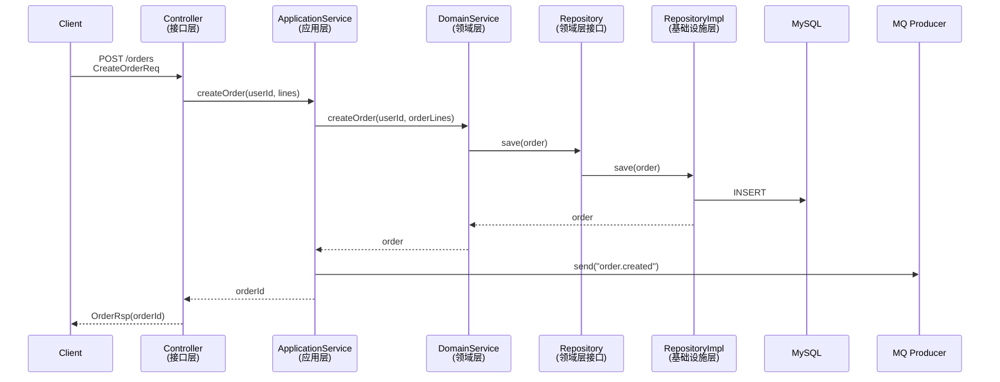

### 代码示例

```java
// ===== 接口层 =====
@Override
public R<OrderRsp> createOrder(CreateOrderReq req) {
    Long orderId = orderService.createOrder(req.getUserId(), req.getLines());
    return R.ok(new OrderRsp(orderId));
}

// ===== 应用层 =====
public Long createOrder(Long userId, List<CreateOrderLineReq> lines) {
    // Req → Model（手写转换）
    List<OrderLine> orderLines = lines.stream()
        .map(l -> new OrderLine(l.getProductId(), l.getQuantity(), l.getPrice()))
        .toList();

    Order order = orderService.createOrder(userId, orderLines);

    // MQ 发送（应用层负责）
    mqProducer.send("order.created", new OrderMessage(order.getId()));

    return order.getId();
}

// ===== 领域层 =====
public Order createOrder(Long userId, List<OrderLine> lines) {
    Order order = new Order();
    order.setUserId(userId);
    order.setLines(lines);
    order.setStatus(OrderStatus.CREATED);
    order.setTotalAmount(calculateTotal(lines));
    orderRepo.save(order);
    return order;
}

// ===== 基础设施层：save 实现 =====
@Override
public void save(Order order) {
    // 领域对象 → Entity 转换
    OrderEntity entity = toEntity(order);
    orderMapper.insert(entity);
    
    // 保存订单行
    for (OrderLine line : order.getLines()) {
        OrderLineEntity lineEntity = toLineEntity(line, entity.getId());
        lineMapper.insert(lineEntity);
    }
}

// Order → OrderEntity 转换（基础设施层内）
private OrderEntity toEntity(Order order) {
    OrderEntity entity = new OrderEntity();
    entity.setId(order.getId());
    entity.setUserId(order.getUserId());
    entity.setStatus(order.getStatus().name());
    entity.setTotalAmount(order.getTotalAmount());
    return entity;
}

private OrderLineEntity toLineEntity(OrderLine line, Long orderId) {
    OrderLineEntity entity = new OrderLineEntity();
    entity.setOrderId(orderId);
    entity.setProductId(line.getProductId());
    entity.setQuantity(line.getQuantity());
    entity.setPrice(line.getPrice());
    return entity;
}
```

---

## 场景二：读操作（单条查询）

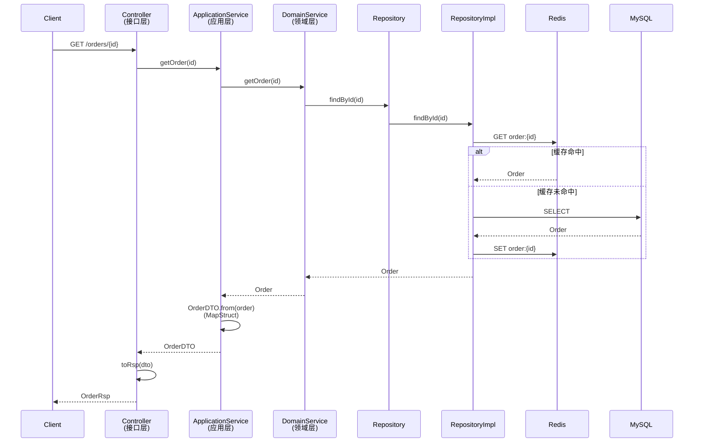

### 代码示例

```java
// ===== 接口层 =====
@Override
public R<OrderRsp> getOrder(Long id) {
    OrderDTO dto = orderService.getOrder(id);
    return R.ok(toRsp(dto));
}

private static OrderRsp toRsp(OrderDTO dto) {
    OrderRsp rsp = new OrderRsp();
    rsp.setId(dto.getId());
    rsp.setStatus(dto.getStatus().name());
    rsp.setTotalAmount(dto.getTotalAmount());
    return rsp;
}

// ===== 应用层 =====
public OrderDTO getOrder(Long id) {
    Order order = orderService.getOrder(id);
    return OrderDTO.from(order);  // MapStruct
}

// ===== 领域层 =====
public Order getOrder(Long id) {
    return orderRepo.findById(id);
}

// ===== 基础设施层 =====
@Override
public Order findById(Long id) {
    Order cached = cache.get("order:" + id, Order.class);
    if (cached != null) return cached;

    // Mapper 返回 Entity，需要转换为领域对象
    OrderEntity entity = orderMapper.selectById(id);
    if (entity != null) {
        Order order = toOrder(entity);
        List<OrderLineEntity> lineEntities = lineMapper.selectByOrderId(id);
        order.setLines(toOrderLines(lineEntities));
        cache.set("order:" + id, order, Duration.ofMinutes(30));
    }
    return order;
}

// Entity → 领域对象转换（基础设施层内）
private Order toOrder(OrderEntity entity) {
    Order order = new Order();
    order.setId(entity.getId());
    order.setUserId(entity.getUserId());
    order.setStatus(OrderStatus.valueOf(entity.getStatus()));
    order.setTotalAmount(entity.getTotalAmount());
    return order;
}

private List<OrderLine> toOrderLines(List<OrderLineEntity> entities) {
    return entities.stream()
        .map(e -> new OrderLine(e.getProductId(), e.getQuantity(), e.getPrice()))
        .toList();
}
```

---

## 场景三：读操作（条件查询）

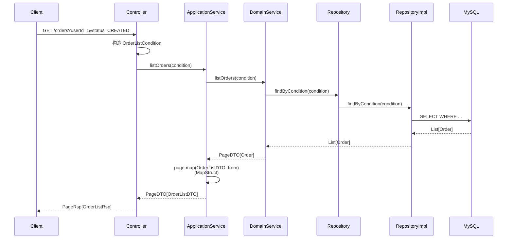

### 代码示例

```java
// ===== 接口层 =====
@Override
public R<PageRsp<OrderListRsp>> listOrders(OrderListReq req) {
    OrderListCondition condition = new OrderListCondition(
        req.getUserId(),
        req.getStatus(),
        req.getPageNum(),
        req.getPageSize()
    );
    PageDTO<OrderListDTO> page = orderService.listOrders(condition);
    return R.ok(toPageRsp(page));
}

// ===== 应用层 =====
public PageDTO<OrderListDTO> listOrders(OrderListCondition condition) {
    PageDTO<Order> page = orderService.listOrders(condition);
    return page.map(OrderListDTO::from);  // MapStruct
}

// ===== Condition（应用层） =====
public class OrderListCondition {
    private Long userId;
    private String status;
    private int pageNum;
    private int pageSize;
}

// ===== 领域层 =====
public PageDTO<Order> listOrders(OrderListCondition condition) {
    return orderRepo.findByCondition(condition);
}

// ===== 基础设施层 =====
@Override
public PageDTO<Order> findByCondition(OrderListCondition condition) {
    List<OrderEntity> entities = orderMapper.selectByCondition(condition);
    List<Order> orders = entities.stream()
        .map(this::toOrder)
        .toList();
    // 分页信息从 condition 构造
    return new PageDTO<>(orders, condition.getPageNum(), condition.getPageSize());
}
```

---

## 场景四：外部 HTTP 调用

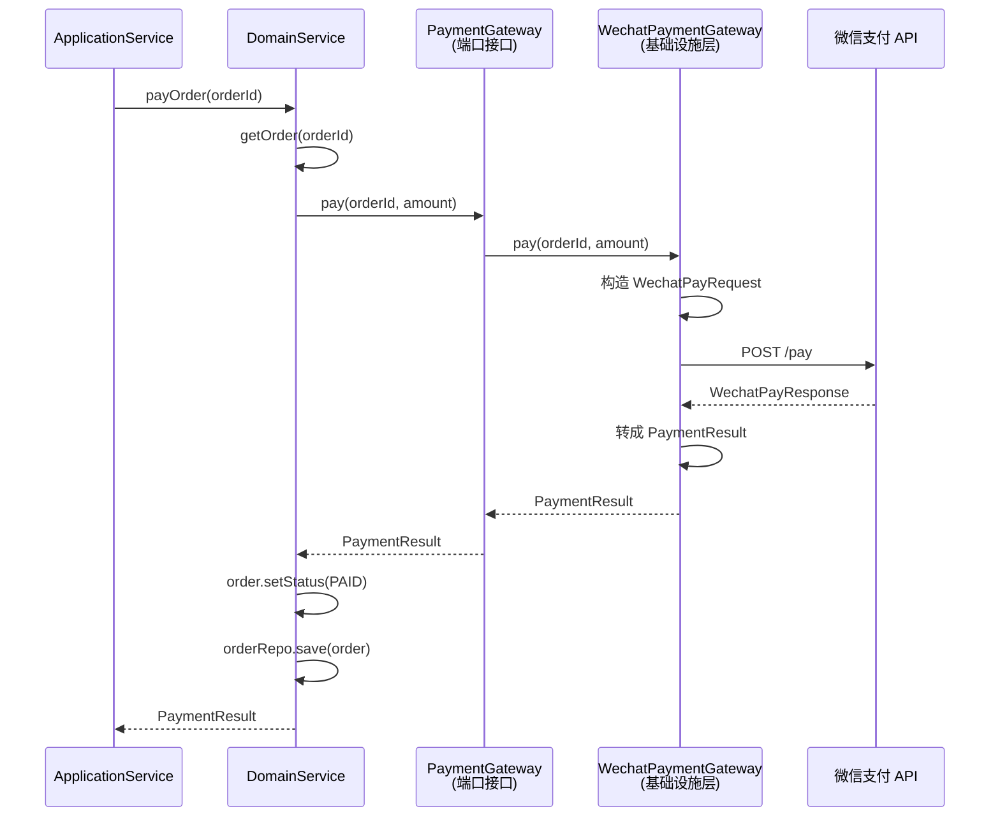

### 代码示例

```java
// ===== 领域层：端口接口 =====
public interface PaymentGateway {
    PaymentResult pay(Long orderId, BigDecimal amount);
}

// ===== 领域层：服务 =====
public class OrderService {
    private final OrderRepository orderRepo;
    private final PaymentGateway paymentGateway;

    public PaymentResult payOrder(Long orderId) {
        Order order = orderRepo.findById(orderId);
        PaymentResult result = paymentGateway.pay(orderId, order.getTotalAmount());
        order.setStatus(OrderStatus.PAID);
        order.setTradeNo(result.getTradeNo());
        orderRepo.save(order);
        return result;
    }
}

// ===== 基础设施层：支付网关实现 =====
public class WechatPaymentGateway implements PaymentGateway {
    private final RestClient httpClient;

    @Override
    public PaymentResult pay(Long orderId, BigDecimal amount) {
        // 领域对象 → 外部请求对象（只在基础设施层）
        WechatPayRequest req = new WechatPayRequest(orderId, amount);
        WechatPayResponse resp = httpClient.post("/pay", req);
        // 外部响应 → 领域对象
        return new PaymentResult(resp.getTradeNo(), resp.getStatus());
    }
}

// ===== 基础设施层：save 实现（支付后更新订单） =====
@Override
public void save(Order order) {
    OrderEntity entity = toEntity(order);
    orderMapper.updateById(entity);
}
```

---

## 场景五：MQ 消息

### 发送消息

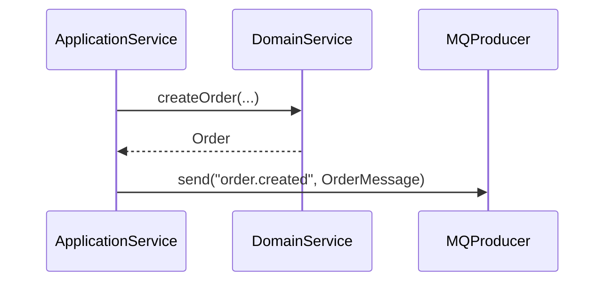

### 接收消息

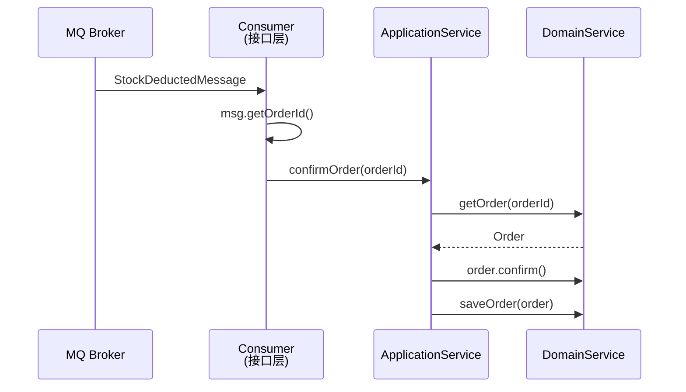

### 代码示例

```java
// ===== 发送消息（应用层） =====
public Long createOrder(Long userId, List<CreateOrderLineReq> lines) {
    Order order = orderService.createOrder(userId, toOrderLines(lines));
    mqProducer.send("order.created", new OrderMessage(order.getId()));
    return order.getId();
}

// ===== 接收消息（接口层） =====
@Component
public class OrderEventConsumer {
    private final OrderApplicationService orderService;

    @RabbitListener(queues = "stock.deducted.queue")
    public void onStockDeducted(StockDeductedMessage msg) {
        orderService.confirmOrder(msg.getOrderId());
    }
}

// ===== 应用层 =====
public void confirmOrder(Long orderId) {
    Order order = orderService.getOrder(orderId);
    order.confirm();
    orderService.saveOrder(order);
}
```

---

## 场景六：定时任务

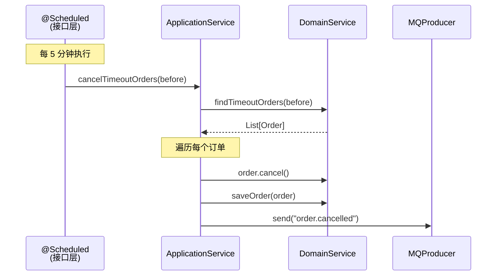

### 代码示例

```java
// ===== 接口层 =====
@Component
public class OrderScheduledJobs {
    private final OrderApplicationService orderService;

    @Scheduled(cron = "0 */5 * * * ?")
    public void cancelTimeoutOrders() {
        orderService.cancelTimeoutOrders(LocalDateTime.now().minusMinutes(30));
    }
}

// ===== 应用层 =====
public void cancelTimeoutOrders(LocalDateTime before) {
    List<Order> orders = orderService.findTimeoutOrders(before);
    orders.forEach(order -> {
        order.cancel();
        orderService.saveOrder(order);
        mqProducer.send("order.cancelled", new OrderMessage(order.getId()));
    });
}
```

---

## 边界规则速查表

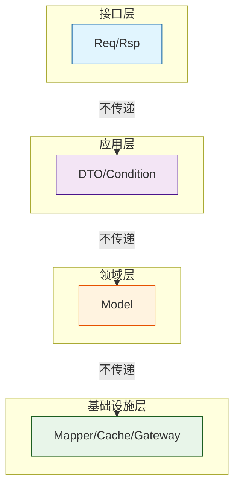

| 规则 | 说明 |
|---|---|
| Req/Rsp 不出接口层 | 只在 Controller/Consumer/ScheduledJob 内 |
| DTO 不出应用层 | 不传给领域层，不返回给接口层 |
| Model 不出领域层 | 应用层拿到后转成 DTO |
| 外部请求/响应不出基础设施层 | 只在 Gateway 实现内 |

---

## 常见错误

| 错误 | 问题 | 正确做法 |
|---|---|---|
| 应用层入参叫 `Param` | 无业务含义 | 用 DTO 或直接拆字段 |
| 领域层实体叫 `XxxEntity` | 冗余，Entity 后缀属于基础设施层 | 领域层直接叫 `Xxx`，基础设施层叫 `XxxEntity` |
| 写 `OrderConverter.toDTO(order)` | 工具类无意义 | `OrderDTO.from(order)` + MapStruct |
| DTO 传给领域层 | 破坏隔离 | 应用层拆分字段 |
| Model 直接返回给接口层 | 破坏隔离 | 应用层转成 DTO |
| 外部 API 对象泄露到领域层 | 破坏隔离 | 基础设施层转换 |
| Mapper 直接返回领域对象 | 绕过 Entity 层 | Mapper 返回 Entity，基础设施层转为领域对象 |

---

## 开发流程

### 新增接口

```mermaid
graph LR
    A[OpenAPI 定义] --> B[api-codegen]
    B --> C[Req + Rsp + 接口]
    C --> D[手写 ApiImpl]
    D --> E[ApplicationService]
    E --> F[DomainService]
    F --> G[Repository 接口]
    G --> H[RepositoryImpl]
    H --> I[MyBatis Mapper]

    style A fill:#ffcdd2,stroke:#c62828
    style B fill:#fff9c4,stroke:#f9a825
    style C fill:#e1f5fe,stroke:#01579b
    style D fill:#e1f5fe,stroke:#01579b
    style E fill:#f3e5f5,stroke:#4a148c
    style F fill:#fff3e0,stroke:#e65100
    style G fill:#fff3e0,stroke:#e65100
    style H fill:#e8f5e9,stroke:#1b5e20
    style I fill:#e8f5e9,stroke:#1b5e20
```

### 修改接口

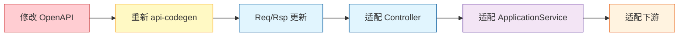
